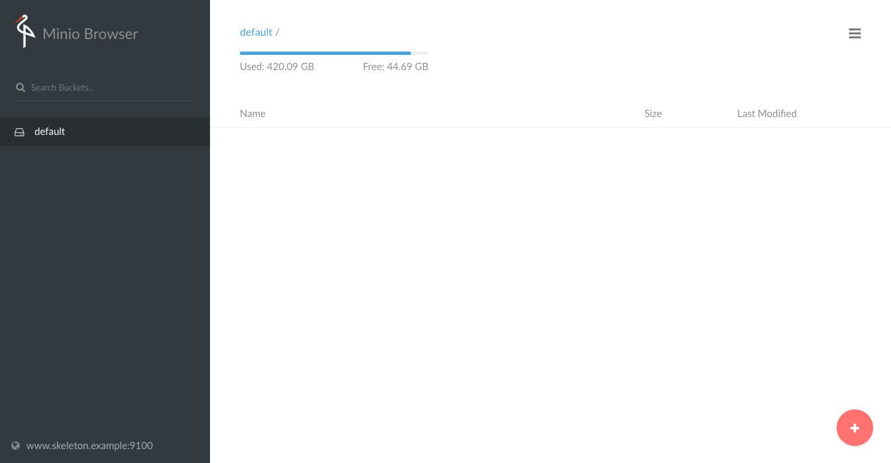

# YALS

Aka __yet another Laravel skeleton__ (app).

## Features

- Laravel 5.5 and PHP 7.1
- Single command initialization
- Fully provisioned Homestead vagrant VM
- All most common dev tech and services included
- No-downtime Envoy script to immediately deploy to production
- Ready-to-go production backups using spatie/laravel-backup
- And much more!

### Virtual machine

Laravel Homestead vagrant box with:

- Composer
- Yarn
- MySQL
- Elasticsearch (disabled by default)
- Elasticdump (disabled by default)
- Kibana (Elasticsearch GUI) (disabled by default)
- Minio (local S3 storage server)
- Mailhog (local mail catcher)
- Byobu (advanced tmux/screen CLI window management)
- Prestissimo (parallel composer requests)

And:

- a complete set of custom bash aliases
- autocomplete ignores file case
- all services upgraded to their latest versions

### Composer packages

- laravel/horizon
- [spatie/laravel-html](https://github.com/spatie/laravel-html)
- …

### NPM packages

- Axios
- Bootstrap SASS
- Cross-env
- jQuery
- Laravel Mix
- Lodash
- Vue

### No-downtime Envoy deploy script

Executed using Yarn commands.

### Other

- Supervisord production config template for Horizon
- Stripped all routes files in favor of [routers](https://www.github.com/sebastiaanluca/laravel-router)
- Encouraged to use nwidart/laravel-modules to group your features together
- Dropbox filesystem support

## How to use

### First run

Adjust `Homestead.yaml` in the root directory to your liking. Then update `.env` so it resembles your Homestead VM configuration (think database and app URL).

Open a terminal and edit your `/etc/hosts` file using `sudo nano /etc/hosts`. Add the following (replace with your domain and used IP):

```
192.168.98.47    skeleton.example www.skeleton.example
```

Save and quit nano with `CTRL+X`, then hit `y` to confirm.

Run the init command and wait (a while). You will be automatically SSHed into the VM.

```
yarn run init-vm
```

Open your browser and navigate to [https://www.skeleton.example]().

Profit!

### Services

#### Mailhog


Navigate to [http://www.skeleton.example:8025]() on your local machine.

#### Minio



Navigate to [http://www.skeleton.example:9100]() on your local machine.

Minio uses the `storage/minio/default` directory as default bucket storage path.

#### Horizon

Navigate to [http://www.skeleton.example/horizon]() on your local machine.

### Resource scaffolding

1. Create a module: `php artisan module:make Projects`
2. Add its namespace to `composer.json` (both PSR-4 autoload and autoload-dev for tests)
3. Add its tests directories to `phpunit.xml`
4. Scaffold a resource
5. Register its router by adding it to the app HTTP kernel or the service provider routers array
